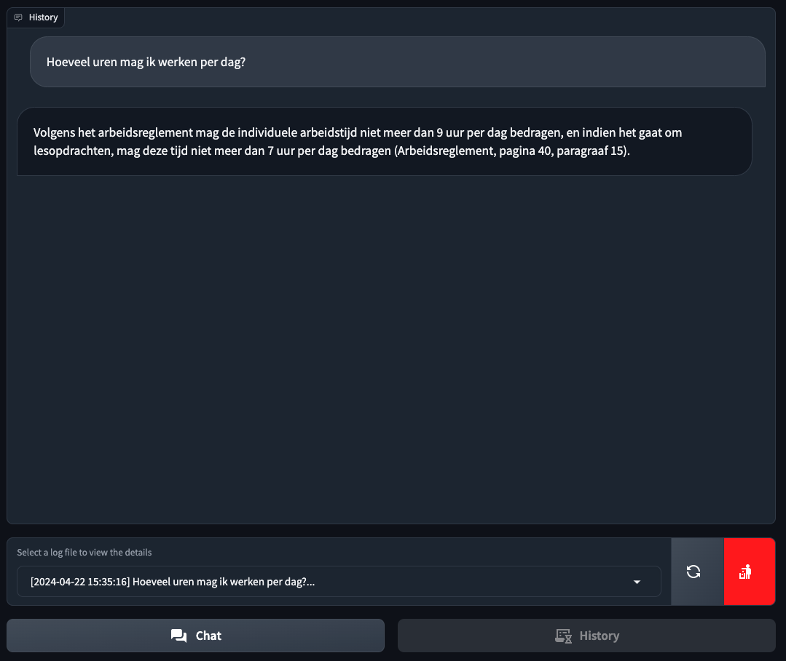

# TransformAI LLM Chat

## What's in this repository?
This repository contains two "chatbot" examples using the Azure OpenAI as LLM under the hood:
- `chat_demo` a basic chat app using the "Completions API"
- `chat_llm_azure` a chat app using the "Assistant API", including a chat history viewer
- `rag_demo` tools and utilities to implement RAG using ChromaDB
- `slack_demo` demo code for a Slack bot (with LLM integration)

## Configuration
To install the necessary libraries use `pip install -r requirements.txt`

Please create an `.env` file with the same structure as the provided `.env.example` file, 
and enter your personal (Azure OpenAI) **key** and **endpoint** therein.

## Use
Run the python script from the terminal (or your IDE). 

It will print out a **URL** to the console. 
The default URL is http://127.0.0.1:7860, which is running local only. 
To create a publicly accessible link, set `share=True` in the Gradio `launch()` call.

Surf to the generated address in your browser to use the (Gradio) web UI

## Screenshots

### chat.py
`/chat_demo`

### launch_ui.py
`/chat_llm_azure`

## License
Icons by <a target="_blank" href="https://icons8.com">Icons8</a>
